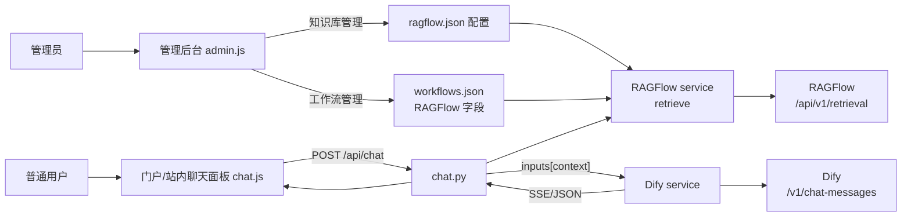

## 产品概述

在现有 AI 应用平台（void4）中，将 RAGFlow 作为知识库接入 Dify 聊天流程。核心思路是：用户在前端网页（平台自己的站内聊天面板）发起对话，后端在转发给 Dify 之前，先调用 RAGFlow 检索 API 获取相关文档片段，将片段作为上下文注入 Dify 请求，使 Dify 的回答能结合 RAGFlow 知识库内容。由于 RAGFlow 与 Dify 的接口格式不同，需要后端编写参数转换与桥接逻辑。

## 核心功能

- 前端聊天改为平台站内的自定义聊天面板（替换当前 Dify iframe 方式），通过后端 `/api/chat` 接口收发消息，支持流式输出。
- 后端 `/api/chat` 在调用 Dify 前，若当前工作流启用了 RAGFlow 检索，则调用 RAGFlow 检索 API，把检索到的文档片段整理成上下文，注入 Dify 请求的 `inputs` 变量。
- RAGFlow 服务地址、API Key、检索开关、上下文变量名在管理后台配置（不写死），管理员自行填写。
- 权限区分：普通用户登录后仅看到 Dify 智能体应用卡片，可进入站内聊天；管理员登录后才能看到管理后台，管理"工作流管理（添加工作台）"、"账号管理"、"知识库管理"、"数据概览（日志监测）"。
- 管理后台新增"知识库管理" tab，可查看/编辑 RAGFlow 连接配置（地址、API Key），并校验连接状态。

## 边界说明

- RAGFlow 已部署且有地址和 API Key，由管理员在管理后台自行填写。
- Dify 工作流需预留一个接收上下文的输入变量（如 `context`），需指导用户在 Dify 端配置，后端通过配置的变量名注入。
- 不改动现有账号、权限、工作流 CRUD 的基础逻辑。

## 技术栈

- 后端：Python + FastAPI + httpx（复用现有 server 技术栈）。
- 前端：原生 HTML/CSS/JavaScript（复用现有 web 静态前端，无框架）。
- 数据存储：JSON 文件（workflows.json 扩展 RAGFlow 字段；新增 ragflow.json 存全局连接配置）。
- 鉴权：现有 JWT（复用 auth.security）。
- SSE：后端流式转发 Dify 的 text/event-stream，前端用 fetch + ReadableStream 解析。

## 实现思路

核心是在现有"后端封装 Dify"链路（`/api/chat` → `dify_service.py`）中插入 RAGFlow 检索步骤，形成三段式桥接：

```
用户(站内聊天面板) → POST /api/chat
   → 后端检索 RAGFlow (/api/v1/retrieval) 得到文档片段
   → 拼接 context 注入 Dify 请求的 inputs["context"]
   → 后端调用 Dify (/v1/chat-messages 或 /v1/workflows/run) → 返回/流式回传前端
```

### 关键设计决策

1. **复用现有 `inputs` 参数注入上下文**：`dify_service.py` 的 `_build_chat_body` 和 `_build_workflow_body` 已支持把 `inputs` 合并进 Dify 请求。RAGFlow 检索结果作为 `inputs[contextVarName]` 传入，无需改动 Dify 调用协议本身，仅在 `routes/chat.py` 转发前插入检索逻辑。

2. **工作流级 RAGFlow 配置**：在 `workflow_store` 的工作流对象上扩展字段：`ragflowEnabled`(bool)、`ragflowBaseUrl`(str)、`ragflowApiKey`(str)、`ragflowDataset`(str，知识库ID)、`ragflowTopK`(int，默认3)、`ragflowContextVar`(str，默认`context`)。管理员在"工作流管理-编辑"中填写，与现有 baseUrl/apiKey 的配置方式一致，侵入小。`WorkflowPublic` 不暴露 ragflowApiKey。

3. **全局 RAGFlow 连接配置**：新增 `ragflow.json` 存储全局服务地址/API Key/默认知识库，供"知识库管理" tab 展示与测试连接；工作流可覆盖或回退到全局配置。配置读写复用现有 store 的线程安全 JSON 模式。

4. **前端聊天面板重做**：将 `#chat-iframe` 容器改为站内消息列表 + 输入框；`chat.js` 改为调用新增的 `API.chat()`（POST /api/chat）。流式模式用 `fetch` + `response.body.getReader()` 按 SSE 事件解析 `answer` 增量渲染；阻塞模式直接渲染 `ChatResponse.answer`。保留现有应用卡片点击入口。

5. **RAGFlow API 调用封装**：新建 `services/ragflow_service.py`，实现 `retrieve(query, dataset, top_k, base_url, api_key)`，调用 `POST {base}/api/v1/retrieval`，Header 用 `Authorization: Bearer {apiKey}`，从返回的 chunks 中提取 `content_with_weight`/`content` 拼接为 context 字符串；同时提供 `test_connection()` 校验配置。

### 性能与可靠性

- RAGFlow 检索 + Dify 调用顺序执行，超时用 `httpx` 的 timeout 控制（复用 `DIFY_TIMEOUT`，为 RAGFlow 增加 `RAGFLOW_TIMEOUT` 配置，默认 60s）。
- RAGFlow 检索失败不应阻断聊天：失败时降级为"直接调用 Dify（不带检索上下文）"，记录日志而非抛错，保证主流程可用。
- 检索结果拼接控制长度（如截断到合理 token 数），避免把超大 context 塞给 Dify。
- 流式响应沿用现有 `StreamingResponse` + `X-Accel-Buffering: no` 模式。

### 避免技术债务

- 全部复用现有 store 线程安全 JSON 读写、路由依赖注入、JWT 鉴权、SSE 流式封装等既有模式，不引入新框架。
- 只新增一个 service（ragflow_service.py）与少量字段/路由，改动面集中在 chat 链路、工作流模型、前端聊天面板、管理后台。

## 架构设计



## 目录结构与文件清单

```
d:/code2/void4/server/
├── config.py                     # [MODIFY] 新增 RAGFLOW_TIMEOUT、RAGFLOW_CONFIG_JSON_PATH
├── main.py                       # [MODIFY] include 新增 knowledge 路由
├── models/schemas.py             # [MODIFY] 新增 KnowledgeConfigSchema、KnowledgeConfigUpdate；扩展 WorkflowBase/WorkflowPublic 增加 RAGFlow 字段
├── services/
│   ├── dify_service.py           # [MODIFY] 无需改协议，仅在导入处确认 inputs 透传（保持现状即可）
│   ├── ragflow_service.py        # [NEW] RAGFlow 检索封装 + test_connection
│   ├── workflow_store.py         # [MODIFY] create/update 支持 RAGFlow 字段，get_workflow 返回时保留（内部），Public 剥离 apiKey/ragflowApiKey
│   └── knowledge_store.py        # [NEW] ragflow.json 全局配置读写（线程安全）
├── routes/
│   ├── chat.py                   # [MODIFY] 转发 Dify 前调用 RAGFlow 检索，注入 inputs["contextVar"]；支持阻塞/流式
│   └── knowledge.py              # [NEW] GET/PUT 全局 RAGFlow 配置；POST /test 测试连接
d:/code2/void4/web/
├── index.html                    # [MODIFY] 聊天面板改为站内消息区+输入框；管理后台新增"知识库管理" tab；脚本加版本号
├── js/api.js                     # [MODIFY] 新增 chat()、getKnowledge/saveKnowledge/testKnowledge
├── js/chat.js                    # [MODIFY] 改为站内聊天：渲染消息、调用 API.chat()、流式解析 SSE
├── js/admin.js                   # [MODIFY] 新增知识库管理 tab 逻辑（加载/保存/测试连接）；工作流表单增加 RAGFlow 字段
├── js/app.js                     # [MODIFY] 工作流卡片点击仍走 Chat.open；管理员后台 tab 初始化包含 knowledge
└── css/style.css                 # [MODIFY] 新增站内聊天消息气泡、输入区、知识库管理样式
```

## 关键接口（要点）

- `POST /api/knowledge/config`（管理员）返回当前全局 RAGFlow 配置（不含 API Key 明文，用掩码）。
- `PUT /api/knowledge/config`（管理员）保存地址/API Key/默认知识库。
- `POST /api/knowledge/test`（管理员）测试 RAGFlow 连接，返回成功/失败信息。
- `ChatRequest` 复用现有结构；后端在 `routes/chat.py` 内，若工作流 `ragflowEnabled` 为真，先 `ragflow_service.retrieve(...)`，再 `inputs = {**body.inputs, contextVar: context}` 后调 Dify。
- `WorkflowBase` 新增字段：`ragflowEnabled: bool=False`、`ragflowBaseUrl: str=""`、`ragflowApiKey: str=""`、`ragflowDataset: str=""`、`ragflowTopK: int=3`、`ragflowContextVar: str="context"`；`WorkflowPublic` 不含 `ragflowApiKey`。

## 执行要点

- 浏览器缓存：所有改动 JS 引用加版本号 `?v=4`，CSS 加 `?v=4`，避免沿用 `?v=3` 旧缓存。
- 降级策略：RAGFlow 检索异常时仅记录日志（复用 logging），不阻断 Dify 聊天，保证普通用户聊天主流程始终可用。
- 兼容性：保留 `iframeUrl` 字段（不删除），旧数据不受影响；新聊天面板优先走 `/api/chat`，若某工作流未配 Dify apiKey 则提示配置。
- 日志安全：不打印 API Key；知识库配置返回给前端时对 Key 做掩码。

## 设计风格

在现有平台基础上重做站内聊天面板与管理后台的知识库管理，保持现代、简洁、专业的视觉基调，与现有 app-card / 管理表格风格统一。

## 站内聊天面板

- 布局：右侧滑出式浮层面板（复用现有 #chat-panel），顶栏保留应用图标/名称/关闭按钮；中间为消息流，底部为输入区（文本输入框 + 发送按钮）。
- 消息气泡：用户消息靠右（主题色底、白字），助手消息靠左（浅灰底、深色字）；流式输出时对当前助手气泡增量追加文本。
- 状态提示：发送中显示"思考中..."气泡；错误以红色提示气泡展示。
- 支持回车发送、Shift+Enter 换行；空输入禁用发送。
- 面板宽度约 420px，全高布局，移动端自适应为全屏。

## 管理后台知识库管理 tab

- 与现有 admin-tabs 一致的新 tab，面板内含配置卡片：RAGFlow 服务地址、API Key（密码框）、默认知识库 ID、Top-K、检索开关说明。
- 提供"测试连接"按钮，结果以成功/失败提示条展示。
- 文案与表单样式复用现有 .form-card / .field / .btn-primary 体系，保证视觉一致性。

## 页面关系

- 普通用户：登录 → 门户（应用卡片列表）→ 点击卡片 → 站内聊天面板。
- 管理员：登录 → 管理后台 → 四个 tab（工作流管理 / 账号管理 / 知识库管理 / 数据概览），可返回应用门户。

## Agent Extensions

### Skill

- **agent-browser**
- Purpose: 用于在实现后验证站内聊天面板与管理后台知识库配置页面的实际渲染与交互（打开页面、输入、点击发送、查看 SSE 流式输出、测试连接按钮），并截图确认 UI 正常。
- Expected outcome: 验证前端聊天面板可正常加载、可发送消息并渲染流式回复，管理后台知识库 tab 可保存/测试 RAGFlow 配置，发现并反馈渲染或交互问题。

---

# 历次计划记录（按时间顺序）

> 本文档逐步归档各期开发计划，新计划追加在末尾（时间从早到晚）。每期标注功能目标、核心改动与完成状态。

## 第 1 期：AI 门户基础改造（void3 → void4）

- **状态**：✅ 已完成
- **目标**：将原本纯前端 iframe 直接嵌入 Dify 的方式，升级为本地 FastAPI 后端封装 Dify API + 用户/管理员双角色登录与权限体系。
- **核心改动**：
  - 后端：`server/auth/security.py`（JWT 签发校验、密码哈希、角色依赖）、`server/routes/`（auth / workflows / accounts / chat / dashboard）、`server/config.py`（端口、JWT、CORS、文件路径）。
  - 数据：`users.json`（bcrypt 密码）、`workflows.json`（含 apiKey，仅后端可读）、`conversations.json`（对话统计）。
  - 前端：登录页 + 应用门户 + 管理后台 + 聊天面板（iframe）。
- **要点**：管理员可视化新增/编辑/删除工作流；普通用户仅见已启用工作流；`apiKey` 永不返回前端。

## 第 2 期：站内聊天 + RAGFlow 知识库接入（void4 → void5）

- **状态**：✅ 已完成（即本文档主体「产品概述」章节）
- **目标**：前端改为平台站内自定义聊天面板（替换 Dify iframe），后端 `/api/chat` 在转发 Dify 前先调用 RAGFlow 检索，把文档片段注入 Dify 的 `inputs[contextVar]`。
- **核心改动**：
  - 新增 `services/ragflow_service.py`（检索 + 测试连接）、`services/knowledge_store.py`（`ragflow_config.json` 全局配置）。
  - 新增 `routes/knowledge.py`（GET/PUT 全局配置、POST /test 测试连接）。
  - `routes/chat.py` 转发前插入 RAGFlow 检索；工作流扩展 `ragflowEnabled/ragflowBaseUrl/ragflowApiKey/ragflowDataset/ragflowTopK/ragflowContextVar` 字段。
  - 前端聊天面板改为站内消息区 + 输入框，支持 SSE 流式解析。
- **要点**：RAGFlow 检索失败不阻断聊天（降级为直接调用 Dify）；日志不打印 API Key，配置返回前端时对 Key 掩码。

## 第 3 期：多服务器知识库实体管理

- **状态**：✅ 已完成
- **目标**：支持一个或多个 RAGFlow 服务器作为独立「知识库实体」，每个实体可有各自不同的地址与 API Key，由添加它的管理员管理。
- **核心改动**：
  - 新增 `services/knowledge_bases.py` 与 `data/knowledge_bases.json`。
  - 新增 `routes/knowledge_bases.py`：列表 / 新增 / 修改 / 删除 / 测试连接 / 拉取数据集 / 拉取文档。
  - 权限：所有管理员可见全部知识库；仅添加者（owner）可修改/删除；被工作流绑定的知识库禁止删除（删除保护）。
- **要点**：工作流可跨多个知识库服务器绑定（`ragBindings`，可精确到数据集甚至单个文档）；聊天检索时逐个服务器检索合并上下文。

## 第 4 期：历史会话 + 续聊（DeepSeek 式）

- **状态**：✅ 已完成
- **目标**：像 DeepSeek 一样点击历史可继续对话。仅 chatflow 续聊；入口为聊天面板内可折叠侧栏；按用户隔离。
- **核心改动**：
  - 新增 `services/session_store.py`（线程安全读写 `data/sessions.json`，按 username 隔离）、`routes/sessions.py`（GET/DELETE `/api/sessions`）。
  - `models/schemas.py`：`ChatRequest` 增加 `session_id`，`ChatResponse` 增加 `session_id`。
  - `routes/chat.py`：`_resolve_session` 解析/创建会话、落库用户消息 + 回复 + `conversation_id`，流式累积后写回，末尾 `yield event: session` 回传 `session_id`。
  - 前端：`api.js` 新增 listSessions/getSession/deleteSession + SSE 解析捕获 session 事件；`index.html` 聊天面板新增历史侧栏 `#chat-history`；`chat.js` 实现 loadHistory/renderHistory/openSession/newSession/deleteSessionItem/渲染消息。
- **要点**：仅 chatflow 支持续聊；历史会话按用户隔离（bob 看不到 alice）；续聊复用 `conversation_id` 接续 Dify 上下文。

## 第 5 期：操作日志筛选（纯前端）

- **状态**：✅ 已完成
- **目标**：管理员操作日志支持按「操作人 / 动作」筛选。
- **核心改动**：
  - `web/index.html`：`#tab-audit` 新增 `.audit-filter` 筛选条（`#audit-filter-user`、`#audit-filter-action` 下拉 + `#audit-filter-reset` 重置）。
  - `web/js/admin.js`：`loadAudit` 缓存全量 → 动态去重生成选项 → 叠加过滤渲染；新增 `resetAuditFilter()`。
  - `web/css/style.css`：`.audit-filter` 一行 flex 样式。
- **要点**：纯前端实现，不请求后端；筛选选项从日志数据动态去重生成。

## 第 6 期：工作流 ID 显示为名称

- **状态**：✅ 已完成
- **目标**：数据概览「最近对话」表格中的长工作流 UUID 替换为工作流名称。
- **核心改动**：
  - `web/js/admin.js` `renderRecentTable`：构建 `wfNameMap`（遍历 `Admin.allWorkflows`），命中显示名称，未命中降级为 `id.substring(0,8)+'…'`。
- **要点**：`enterAdmin()` 先 `switchTab('workflows')` 填充 `allWorkflows` 再渲染 dashboard，时序正确；仅显示层替换，底层 UUID 不变。

## 第 7 期：操作日志授权工作流显示名称（plan：audit-log-workflow-name）

- **状态**：✅ 已完成
- **目标**：操作日志详情里的长工作流 UUID（如 `账号「12345」(角色=user)，授权工作流: ['1e3a4c9b-...']`）替换为工作流名称。
- **范围约定**：仅改今后新写入的日志，不改历史 `audit_log.json`；底层 `allowed_workflow_ids` 真实 UUID 不变，不影响授权。
- **核心改动**：
  - `server/routes/accounts.py`：新增辅助函数 `_wf_ids_to_names(ids)`（用 `workflow_store.get_workflow(id)` 查名称，查不到降级 `id[:8]`）；将 `create_account` / `update_account` 两处日志 detail 中的 `result.get('allowed_workflow_ids') or []` 替换为 `_wf_ids_to_names(...)`；新增 `workflow_store` import。
- **效果示例**：`账号「12345」(角色=user)，授权工作流: ['test']`。

## 第 8 期：移除 RAGFlow / 知识库功能（保留 Dify + 上传）

- **状态**：✅ 已完成
- **目标**：彻底删除 RAGFlow 检索与知识库管理相关功能，平台仅保留「Dify 对话对接 + 文件上传」。
- **核心改动**：
  - 后端删除：`services/ragflow_service.py`、`services/knowledge_store.py`、`services/knowledge_bases.py`、`routes/knowledge.py`、`routes/knowledge_bases.py`。
  - 后端清理：`chat.py` 移除 RAG 检索注入（`_retrieve_from_base` / `_enrich_with_ragflow` / `_enrich_legacy`），直接透传 `inputs`；`workflows.py` 移除 `/datasets` 接口与知识库隐藏/绑定逻辑；`config.py` 移除 RAGFlow 配置与路径；`main.py` 移除 knowledge 路由注册；`schemas.py` 移除工作流 RAG 字段与 RAGFlow 配置模型；`workflow_store.py` 移除 RAG 字段。
  - 前端删除：`api.js` 知识库接口；`admin.js` 知识库管理逻辑；`index.html` 知识库标签页与工作流表单 RAG 区；`style.css` 知识库相关样式。
  - 数据：删除 `ragflow_config.json`、`knowledge_bases.json`；`workflows.json` 移除各工作流 `rag*` 字段。
- **要点**：上传功能（`/api/upload`）与 Dify 对话转发完全保留、不受影响。

## 第 9 期：修复文件上传到 Dify（上传代理）

- **状态**：✅ 已完成
- **目标**：修复"上传附件后 Dify 端 `sys.files` 为空"的问题——平台只把文件存本地、透传平台 ID 给 Dify，导致 Dify 认不出文件。
- **核心改动**：
  - `server/services/dify_service.py`：实现真正的**文件上传代理**——新增 `_resolve_local_file()`（按 `upload_file_id` 在 `uploads/` 找真实文件）、`_upload_file_to_dify()`（调 Dify `POST /v1/files/upload` 上传）、`_upload_files()`（批量上传并替换为 Dify 真实 id）；`call_dify_blocking` / `call_dify_streaming` 发消息前先上传文件；文件上传成功状态码接受 `200/201`。
  - 前端 `web/js/api.js`：上传改用 `XMLHttpRequest`，支持 `onProgress` 进度回调；`web/js/chat.js` 附件区增加**上传进度条**；`style.css` 进度条样式。
- **要点**：文件按"当前工作流的 baseUrl/apiKey"上传到对应的 Dify，多 Dify 应用互不干扰。

## 第 10 期：workflow 变量卡片 + 前端类型选择 + 类型化改造

- **状态**：✅ 已完成
- **目标**：让 workflow（工作流）类型应用能正确接收输入变量；应用门户按类型选择；修复 workflow 无回复。
- **核心改动**：
  - 后端：`schemas.py` Workflow 增加 `inputFields` 字段；`workflow_store.py` 支持存取；`dify_service.py` 的 `_build_workflow_body` **不再强制注入 query**，只用前端传入的 inputs；`ChatRequest.query` 允许为空。
  - 前端 `web/js/chat.js`：打开 workflow 且配置 `inputFields` 时显示**变量填写卡片**（隐藏聊天输入框），填完点「运行」把字段值作为 inputs 提交。
  - 前端 `web/js/api.js`：修复 workflow 无回复——新增 `workflowOutputsToText()` 解析 `workflow_finished` 事件的 `data.outputs`（过滤 `<think>` 思考块），`handleDataLine` 增加对 `workflow_finished` 的处理。
  - 前端类型选择：`index.html` + `app.js` 新增**类型选择页**（进入门户先选「对话流 / 工作流」），列表页有「返回类型选择」；普通用户无权限类型显示明确提示。
  - 账号权限：`admin.js` 的 `renderWorkflowCheckboxes` 按**类型分组**显示工作流复选框，去掉 emoji 图标只留文字。
- **要点**：workflow 输入字段 key 必须与 Dify 工作流「开始节点」的变量名一致。

## 第 11 期：Agent（智能体）模块

- **状态**：✅ 已完成
- **目标**：平台新增对 Dify Agent（智能体）类型应用的支持，与 chatflow、workflow 并列。
- **核心改动**：
  - 后端 `server/services/dify_service.py`：`is_chatflow` 判断由 `type == "chatflow"` 改为 `type in ("chatflow", "agent")`，Agent 走 `/v1/chat-messages`（对话式接口）。
  - 前端：门户类型选择页新增第三个卡片 **🤖 智能体**；工作流管理 `type` 下拉新增「agent 智能体」；账号权限分组新增「智能体」（空分组自动隐藏）。
  - 对话交互：Agent 复用 chatflow 的对话式交互，`api.js` 只提取 `answer`（**最终回答**），不展示思考过程（`agent_thought` 忽略）。
- **要点**：Agent 的 Skill/工具调用由 Dify 后台完成，平台只需配置 baseUrl + apiKey 即可对话使用。

## 第 12 期：类型图标后端配置 + 管理员可设置（plan：type-icon-config）

- **状态**：✅ 已完成
- **目标**：类型选择页（对话流 / 工作流 / 智能体）的图标从硬编码 emoji 改为后端可配置。类型图标存后端配置文件，仅管理员可设置；无图标时显示类型英文 key 占位；管理员在门户类型选择页点击图标即可弹出上传。
- **核心改动**：
  - 后端：
    - `server/config.py` 新增 `TYPE_ICONS_JSON_PATH = DATA_DIR / "type_icons.json"`。
    - `server/services/type_icon_store.py`（新增）：线程安全读写 `type_icons.json`（`threading.Lock` + 读全/写全），记录 `{chatflow, workflow, agent}` 三种类型的图标 URL；提供 `get_type_icons()` / `get_type_icon(type_name)` / `set_type_icon(type_name, url)`，白名单校验 `TYPE_KEYS`。
    - `server/models/schemas.py` 新增 `TypeIconUpdate`（`url`）与 `TypeIconsPublic`（三个类型 url 默认空串）。
    - `server/routes/types.py`（新增）：`GET /api/types/icons`（`get_current_user` 登录可用）、`PUT /api/types/icons/{type_name}`（`require_admin` 仅管理员），写时记录审计日志「设置类型图标」。
    - `server/main.py` include 注册 `types_router`。
  - 前端：
    - `web/js/api.js` 新增 `getTypeIcons()` / `saveTypeIcon(typeName, url)`，复用 `uploadIcon` + `resolveUrl`。
    - `web/index.html` 类型选择卡片改为动态容器 `<div id="apps-type-select" class="type-select"></div>`，由 `app.js` 渲染；脚本版本号 `api.js?v=6` / `app.js?v=5` / `style.css?v=11`。
    - `web/js/app.js`：新增 `TYPE_META`（含 `fallback` 英文 key：chatflow→`chat`、workflow→`work`、agent→`agent`），新增 `renderTypeSelect()`（有图 ``、无图 `.type-select-icon__fallback` span）、`loadTypeIcons()`（异步拉取后渲染）、`triggerTypeIconUpload(typeName)`（仅管理员；动态创建隐藏 file input 复用，复用现有 png/jpeg/gif/webp 校验与 3MB 限制；上传→`saveTypeIcon`→重新渲染）；卡片点击通过 `closest('.type-select-icon')` 区分图标区与卡片其他区（图标区管理员触发上传 + `stopPropagation`，其他区域进入应用列表）。
    - `web/css/style.css`：`.type-select-icon` 加 `overflow:hidden`，新增 `.type-select-icon img`（`object-fit:cover` 填满）与 `.type-select-icon__fallback`（主色蓝、0.9rem、字重 700）样式。
- **要点**：
  - **降级字符**：无图时显示 `TYPE_META.fallback`（chat / work / agent），与用户需求一致。
  - **交互冲突**：卡片整体点击进入类型列表；图标区点击管理员触发上传，`stopPropagation` 阻止冒泡；非管理员点击图标区无上传行为（直接进入列表）。
  - **复用零侵入**：图标上传继续走现有 `POST /api/upload/icon`（管理员校验已在后端），不引入新上传接口。
  - **审计日志**：管理员保存类型图标时记录「设置类型图标 · 类型「对话流」图标 已更新/已清除」。

## 附录：如何新增一期计划

- 在本文档末尾追加一个新的 `## 第 N 期：xxx` 章节。
- 字段建议：状态（✅ 已完成 / 🚧 进行中 / 📋 待规划）、目标、核心改动（后端 / 前端 / 数据）、要点与效果示例。
- 若某期有独立命名（如 `audit-log-workflow-name`），在标题中注明以便对照。
