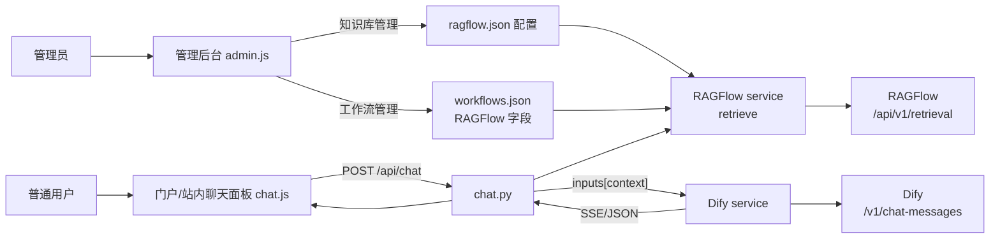

## 产品概述

在现有 AI 应用平台（void4）中，将 RAGFlow 作为知识库接入 Dify 聊天流程。核心思路是：用户在前端网页（平台自己的站内聊天面板）发起对话，后端在转发给 Dify 之前，先调用 RAGFlow 检索 API 获取相关文档片段，将片段作为上下文注入 Dify 请求，使 Dify 的回答能结合 RAGFlow 知识库内容。由于 RAGFlow 与 Dify 的接口格式不同，需要后端编写参数转换与桥接逻辑。

## 核心功能

- 前端聊天改为平台站内的自定义聊天面板（替换当前 Dify iframe 方式），通过后端 `/api/chat` 接口收发消息，支持流式输出。
- 后端 `/api/chat` 在调用 Dify 前，若当前工作流启用了 RAGFlow 检索，则调用 RAGFlow 检索 API，把检索到的文档片段整理成上下文，注入 Dify 请求的 `inputs` 变量。
- RAGFlow 服务地址、API Key、检索开关、上下文变量名在管理后台配置（不写死），管理员自行填写。
- 权限区分：普通用户登录后仅看到 Dify 智能体应用卡片，可进入站内聊天；管理员登录后才能看到管理后台，管理"工作流管理（添加工作台）"、"账号管理"、"知识库管理"、"数据概览（日志监测）"。
- 管理后台新增"知识库管理" tab，可查看/编辑 RAGFlow 连接配置（地址、API Key），并校验连接状态。

## 边界说明

- RAGFlow 已部署且有地址和 API Key，由管理员在管理后台自行填写。
- Dify 工作流需预留一个接收上下文的输入变量（如 `context`），需指导用户在 Dify 端配置，后端通过配置的变量名注入。
- 不改动现有账号、权限、工作流 CRUD 的基础逻辑。

## 技术栈

- 后端：Python + FastAPI + httpx（复用现有 server 技术栈）。
- 前端：原生 HTML/CSS/JavaScript（复用现有 web 静态前端，无框架）。
- 数据存储：JSON 文件（workflows.json 扩展 RAGFlow 字段；新增 ragflow.json 存全局连接配置）。
- 鉴权：现有 JWT（复用 auth.security）。
- SSE：后端流式转发 Dify 的 text/event-stream，前端用 fetch + ReadableStream 解析。

## 实现思路

核心是在现有"后端封装 Dify"链路（`/api/chat` → `dify_service.py`）中插入 RAGFlow 检索步骤，形成三段式桥接：

```
用户(站内聊天面板) → POST /api/chat
   → 后端检索 RAGFlow (/api/v1/retrieval) 得到文档片段
   → 拼接 context 注入 Dify 请求的 inputs["context"]
   → 后端调用 Dify (/v1/chat-messages 或 /v1/workflows/run) → 返回/流式回传前端
```

### 关键设计决策

1. **复用现有 `inputs` 参数注入上下文**：`dify_service.py` 的 `_build_chat_body` 和 `_build_workflow_body` 已支持把 `inputs` 合并进 Dify 请求。RAGFlow 检索结果作为 `inputs[contextVarName]` 传入，无需改动 Dify 调用协议本身，仅在 `routes/chat.py` 转发前插入检索逻辑。

2. **工作流级 RAGFlow 配置**：在 `workflow_store` 的工作流对象上扩展字段：`ragflowEnabled`(bool)、`ragflowBaseUrl`(str)、`ragflowApiKey`(str)、`ragflowDataset`(str，知识库ID)、`ragflowTopK`(int，默认3)、`ragflowContextVar`(str，默认`context`)。管理员在"工作流管理-编辑"中填写，与现有 baseUrl/apiKey 的配置方式一致，侵入小。`WorkflowPublic` 不暴露 ragflowApiKey。

3. **全局 RAGFlow 连接配置**：新增 `ragflow.json` 存储全局服务地址/API Key/默认知识库，供"知识库管理" tab 展示与测试连接；工作流可覆盖或回退到全局配置。配置读写复用现有 store 的线程安全 JSON 模式。

4. **前端聊天面板重做**：将 `#chat-iframe` 容器改为站内消息列表 + 输入框；`chat.js` 改为调用新增的 `API.chat()`（POST /api/chat）。流式模式用 `fetch` + `response.body.getReader()` 按 SSE 事件解析 `answer` 增量渲染；阻塞模式直接渲染 `ChatResponse.answer`。保留现有应用卡片点击入口。

5. **RAGFlow API 调用封装**：新建 `services/ragflow_service.py`，实现 `retrieve(query, dataset, top_k, base_url, api_key)`，调用 `POST {base}/api/v1/retrieval`，Header 用 `Authorization: Bearer {apiKey}`，从返回的 chunks 中提取 `content_with_weight`/`content` 拼接为 context 字符串；同时提供 `test_connection()` 校验配置。

### 性能与可靠性

- RAGFlow 检索 + Dify 调用顺序执行，超时用 `httpx` 的 timeout 控制（复用 `DIFY_TIMEOUT`，为 RAGFlow 增加 `RAGFLOW_TIMEOUT` 配置，默认 60s）。
- RAGFlow 检索失败不应阻断聊天：失败时降级为"直接调用 Dify（不带检索上下文）"，记录日志而非抛错，保证主流程可用。
- 检索结果拼接控制长度（如截断到合理 token 数），避免把超大 context 塞给 Dify。
- 流式响应沿用现有 `StreamingResponse` + `X-Accel-Buffering: no` 模式。

### 避免技术债务

- 全部复用现有 store 线程安全 JSON 读写、路由依赖注入、JWT 鉴权、SSE 流式封装等既有模式，不引入新框架。
- 只新增一个 service（ragflow_service.py）与少量字段/路由，改动面集中在 chat 链路、工作流模型、前端聊天面板、管理后台。

## 架构设计



## 目录结构与文件清单

```
d:/code2/void4/server/
├── config.py                     # [MODIFY] 新增 RAGFLOW_TIMEOUT、RAGFLOW_CONFIG_JSON_PATH
├── main.py                       # [MODIFY] include 新增 knowledge 路由
├── models/schemas.py             # [MODIFY] 新增 KnowledgeConfigSchema、KnowledgeConfigUpdate；扩展 WorkflowBase/WorkflowPublic 增加 RAGFlow 字段
├── services/
│   ├── dify_service.py           # [MODIFY] 无需改协议，仅在导入处确认 inputs 透传（保持现状即可）
│   ├── ragflow_service.py        # [NEW] RAGFlow 检索封装 + test_connection
│   ├── workflow_store.py         # [MODIFY] create/update 支持 RAGFlow 字段，get_workflow 返回时保留（内部），Public 剥离 apiKey/ragflowApiKey
│   └── knowledge_store.py        # [NEW] ragflow.json 全局配置读写（线程安全）
├── routes/
│   ├── chat.py                   # [MODIFY] 转发 Dify 前调用 RAGFlow 检索，注入 inputs["contextVar"]；支持阻塞/流式
│   └── knowledge.py              # [NEW] GET/PUT 全局 RAGFlow 配置；POST /test 测试连接
d:/code2/void4/web/
├── index.html                    # [MODIFY] 聊天面板改为站内消息区+输入框；管理后台新增"知识库管理" tab；脚本加版本号
├── js/api.js                     # [MODIFY] 新增 chat()、getKnowledge/saveKnowledge/testKnowledge
├── js/chat.js                    # [MODIFY] 改为站内聊天：渲染消息、调用 API.chat()、流式解析 SSE
├── js/admin.js                   # [MODIFY] 新增知识库管理 tab 逻辑（加载/保存/测试连接）；工作流表单增加 RAGFlow 字段
├── js/app.js                     # [MODIFY] 工作流卡片点击仍走 Chat.open；管理员后台 tab 初始化包含 knowledge
└── css/style.css                 # [MODIFY] 新增站内聊天消息气泡、输入区、知识库管理样式
```

## 关键接口（要点）

- `POST /api/knowledge/config`（管理员）返回当前全局 RAGFlow 配置（不含 API Key 明文，用掩码）。
- `PUT /api/knowledge/config`（管理员）保存地址/API Key/默认知识库。
- `POST /api/knowledge/test`（管理员）测试 RAGFlow 连接，返回成功/失败信息。
- `ChatRequest` 复用现有结构；后端在 `routes/chat.py` 内，若工作流 `ragflowEnabled` 为真，先 `ragflow_service.retrieve(...)`，再 `inputs = {**body.inputs, contextVar: context}` 后调 Dify。
- `WorkflowBase` 新增字段：`ragflowEnabled: bool=False`、`ragflowBaseUrl: str=""`、`ragflowApiKey: str=""`、`ragflowDataset: str=""`、`ragflowTopK: int=3`、`ragflowContextVar: str="context"`；`WorkflowPublic` 不含 `ragflowApiKey`。

## 执行要点

- 浏览器缓存：所有改动 JS 引用加版本号 `?v=4`，CSS 加 `?v=4`，避免沿用 `?v=3` 旧缓存。
- 降级策略：RAGFlow 检索异常时仅记录日志（复用 logging），不阻断 Dify 聊天，保证普通用户聊天主流程始终可用。
- 兼容性：保留 `iframeUrl` 字段（不删除），旧数据不受影响；新聊天面板优先走 `/api/chat`，若某工作流未配 Dify apiKey 则提示配置。
- 日志安全：不打印 API Key；知识库配置返回给前端时对 Key 做掩码。

## 设计风格

在现有平台基础上重做站内聊天面板与管理后台的知识库管理，保持现代、简洁、专业的视觉基调，与现有 app-card / 管理表格风格统一。

## 站内聊天面板

- 布局：右侧滑出式浮层面板（复用现有 #chat-panel），顶栏保留应用图标/名称/关闭按钮；中间为消息流，底部为输入区（文本输入框 + 发送按钮）。
- 消息气泡：用户消息靠右（主题色底、白字），助手消息靠左（浅灰底、深色字）；流式输出时对当前助手气泡增量追加文本。
- 状态提示：发送中显示"思考中..."气泡；错误以红色提示气泡展示。
- 支持回车发送、Shift+Enter 换行；空输入禁用发送。
- 面板宽度约 420px，全高布局，移动端自适应为全屏。

## 管理后台知识库管理 tab

- 与现有 admin-tabs 一致的新 tab，面板内含配置卡片：RAGFlow 服务地址、API Key（密码框）、默认知识库 ID、Top-K、检索开关说明。
- 提供"测试连接"按钮，结果以成功/失败提示条展示。
- 文案与表单样式复用现有 .form-card / .field / .btn-primary 体系，保证视觉一致性。

## 页面关系

- 普通用户：登录 → 门户（应用卡片列表）→ 点击卡片 → 站内聊天面板。
- 管理员：登录 → 管理后台 → 四个 tab（工作流管理 / 账号管理 / 知识库管理 / 数据概览），可返回应用门户。

## Agent Extensions

### Skill

- **agent-browser**
- Purpose: 用于在实现后验证站内聊天面板与管理后台知识库配置页面的实际渲染与交互（打开页面、输入、点击发送、查看 SSE 流式输出、测试连接按钮），并截图确认 UI 正常。
- Expected outcome: 验证前端聊天面板可正常加载、可发送消息并渲染流式回复，管理后台知识库 tab 可保存/测试 RAGFlow 配置，发现并反馈渲染或交互问题。
